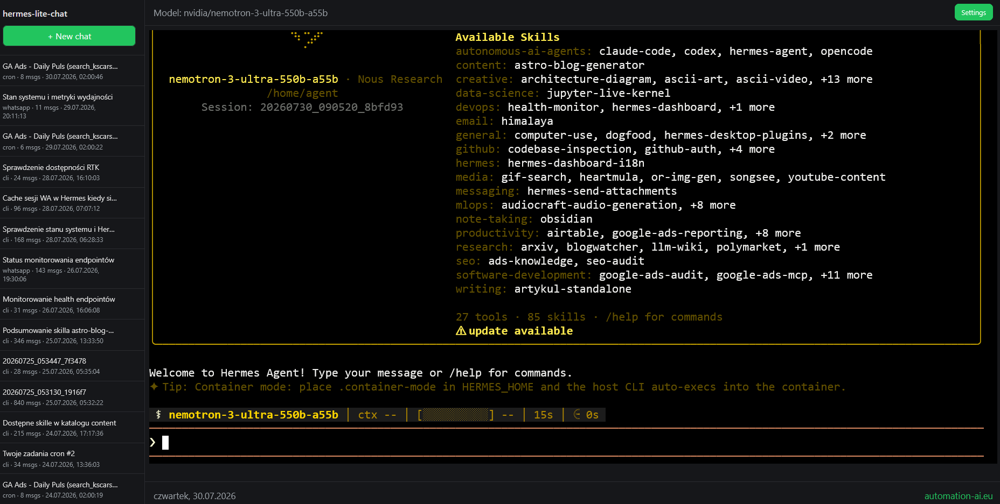

<!--
  =============================================================================
  hermes-lite-chat
  =============================================================================
  Strona   : automation-ai.eu - Automatyzacja AI
  Autor    : Zbigniew Czechowski
  WWW      : https://automation-ai.eu/
  E-mail   : kontakt@automation-ai.eu
  Licencja : MIT
  =============================================================================
-->

# Hermes Lite Chat

Your real Hermes Agent CLI, one browser tab away — not a reimplementation.

[](LICENSE)
[](https://www.python.org/)
[](https://github.com/zbigniew73/hermes-lite-chat)



A web terminal for your local [Hermes Agent](https://hermes-agent.nousresearch.com/) install (`~/.hermes`). It spawns the real `hermes chat --cli` in a PTY and streams it into an `xterm.js` terminal in the browser — not a reimplementation, the literal same CLI program — so tool use, approval prompts, and streaming all behave exactly as they do in a real terminal. The sidebar lists your existing Hermes sessions (read-only, straight from `~/.hermes/state.db`) so you can pick one to resume, or start a new chat.

No API keys of its own: Hermes Agent manages its own credentials and model config (`~/.hermes/config.yaml`).

## Setup

```bash
python -m venv .venv
source .venv/bin/activate
pip install -r requirements.txt
```

```bash
cp .env.example .env
```

`.env` controls:
- `HERMES_HOME` / `HERMES_BIN` — only needed if Hermes Agent lives somewhere other than `~/.hermes`, or `hermes` isn't on `PATH`.
- `HOST` (default `0.0.0.0`) / `PORT` (default `8000`) — this app's own bind address, **independent of Hermes Agent's dashboard on port 9119** (no relation, no conflict — both can run at the same time). `HOST=0.0.0.0` makes it reachable from other devices on your local network; use `HOST=127.0.0.1` to restrict it to this machine only.
- `RELOAD=true` — optional dev auto-reload on file changes.
- `ADMIN_USERNAME` / `ADMIN_PASSWORD` — **bootstrap-only** login (default `admin` / `pass123!`), used just the first time the app runs. Change it from the sidebar ("Change password") afterwards — the real credentials then live hashed (scrypt) in `~/.config/hermes-lite-chat/auth.json`, and editing `.env` after that has no effect.

## Run

```bash
python -m app.main
```

Reads `HOST`/`PORT` (and `RELOAD`) from `.env` automatically. Open `http://<this machine's LAN IP>:8000` from any device on your network (or `http://localhost:8000` from this machine).

Alternative, if you prefer the uvicorn CLI directly (`.env`'s `HOST`/`PORT` are *not* picked up this way — pass flags explicitly):

```bash
uvicorn app.main:app --reload --host 0.0.0.0 --port 8000
```

## Notes / caveats

- The whole app (static assets, API, and the terminal WebSocket) sits behind HTTP Basic Auth. Anyone who *does* log in has the same capabilities as a local terminal session with `hermes` — full tool/shell/browser access. Only run this on a network you trust, and change the default password.
- Closing the tab kills that PTY's `hermes chat` process (it doesn't "pause" — resuming the same session later continues from whatever was already saved to `state.db`).
- Two tabs resuming the *same* session concurrently behave like two terminals attached to the same `--resume` id — governed by Hermes Agent's own active-session logic, not this app.
- `/api/hermes/model` and `/api/hermes/sessions` are read-only lookups (YAML/SQLite); this app never writes to Hermes Agent's config or session database directly.

## Security recommendations

- **Recommended: run this locally, or on a local network you trust, only** (`HOST=127.0.0.1`, or `0.0.0.0` on a trusted LAN). Anyone who logs in gets the same tool/shell/browser access as a real terminal session — treat exposing this app like exposing a terminal, not a website.
- If you do expose it to the public internet anyway, at minimum: put it behind HTTPS (a reverse proxy with a real TLS certificate — plain HTTP Basic Auth sends credentials in an easily-decoded form, not encrypted, over plain HTTP), change the default password immediately, and restrict access further (VPN, IP allowlist, or a firewall rule) instead of leaving the port open to everyone.
- If you do put a reverse proxy in front of it, make sure it forwards the original `Host` header (e.g. nginx's `proxy_set_header Host $host`, not a hardcoded `127.0.0.1:8000`) — this app compares `Host` against `Origin` to block cross-site requests, and a rewritten `Host` will make every login and WebSocket connection fail that check.

## Autostart on boot (systemd user service)

By default the app only runs while you keep the terminal command open. To have it start automatically at boot and keep running after you log out, run it as a `systemd --user` service — no root/sudo needed for the app itself.

### 1. Enable lingering for your user

```bash
loginctl enable-linger "$USER"
```

By default, `systemd --user` services only run while you're logged in (interactively or over SSH) and get killed as soon as your last session ends. `enable-linger` tells systemd to start your user service manager (`user@<uid>.service`) at boot and keep it running independently of any login session, so `hermes-lite-chat` comes up automatically after a reboot and survives logout. Check the status any time with:

```bash
loginctl show-user "$USER" | grep Linger
```

(`Linger=yes` means it's active; `loginctl disable-linger "$USER"` reverses it.)

### 2. Install the service

A small, self-contained script generates and installs the unit file for you. It detects the repo location, the `.venv` interpreter, and the current user, so it works regardless of where you cloned the repo or which account runs it:

```bash
./scripts/install-systemd-user-service.sh
```

It writes `~/.config/systemd/user/hermes-lite-chat.service`, then runs `daemon-reload` and `enable --now`. Do the Setup steps above first (`.venv` + `pip install -r requirements.txt`) — the script checks for `.venv/bin/python` and exits with a clear message if it's missing.

### 3. Manage it

```bash
systemctl --user status  hermes-lite-chat   # is it running?
systemctl --user stop    hermes-lite-chat
systemctl --user start   hermes-lite-chat
systemctl --user restart hermes-lite-chat   # e.g. after editing .env
journalctl --user -u hermes-lite-chat -f    # follow logs
```

To remove the autostart entirely:

```bash
systemctl --user disable --now hermes-lite-chat
rm ~/.config/systemd/user/hermes-lite-chat.service
systemctl --user daemon-reload
```

---

# Hermes Lite Chat (wersja polska)

Terminal webowy dla lokalnej instalacji [Hermes Agent](https://hermes-agent.nousresearch.com/) (`~/.hermes`). Uruchamia prawdziwe `hermes chat --cli` w PTY i strumieniuje je do terminala `xterm.js` w przeglądarce — to nie jest reimplementacja, tylko dosłownie ten sam program CLI — dzięki czemu korzystanie z narzędzi, prompty zatwierdzania i strumieniowanie zachowują się dokładnie tak samo jak w prawdziwym terminalu. Pasek boczny wyświetla listę istniejących sesji Hermesa (tylko do odczytu, bezpośrednio z `~/.hermes/state.db`), dzięki czemu można wznowić dowolną z nich albo rozpocząć nową rozmowę.

Aplikacja nie ma własnych kluczy API: Hermes Agent zarządza swoimi danymi uwierzytelniającymi i konfiguracją modelu (`~/.hermes/config.yaml`) samodzielnie.

## Instalacja

```bash
python -m venv .venv
source .venv/bin/activate
pip install -r requirements.txt
```

```bash
cp .env.example .env
```

Plik `.env` kontroluje:
- `HERMES_HOME` / `HERMES_BIN` — potrzebne tylko wtedy, gdy Hermes Agent jest zainstalowany gdzie indziej niż `~/.hermes`, albo `hermes` nie jest dostępne w `PATH`.
- `HOST` (domyślnie `0.0.0.0`) / `PORT` (domyślnie `8000`) — własny adres nasłuchu tej aplikacji, **niezależny od dashboardu Hermes Agent na porcie 9119** (brak jakiegokolwiek powiązania czy konfliktu — obie usługi mogą działać jednocześnie). `HOST=0.0.0.0` udostępnia aplikację innym urządzeniom w Twojej sieci lokalnej; użyj `HOST=127.0.0.1`, żeby ograniczyć dostęp tylko do tej maszyny.
- `RELOAD=true` — opcjonalny tryb deweloperski z automatycznym przeładowaniem przy zmianie plików.
- `ADMIN_USERNAME` / `ADMIN_PASSWORD` — login **tylko na pierwsze uruchomienie** (domyślnie `admin` / `pass123!`), używany wyłącznie przy pierwszym starcie aplikacji. Zmień go później z poziomu paska bocznego ("Change password") — od tego momentu prawdziwe dane logowania są przechowywane jako hash (scrypt) w `~/.config/hermes-lite-chat/auth.json`, a edycja `.env` nie ma już żadnego znaczenia.

## Uruchomienie

```bash
python -m app.main
```

Automatycznie odczytuje `HOST`/`PORT` (oraz `RELOAD`) z pliku `.env`. Otwórz `http://<adres-IP-tej-maszyny-w-sieci-lokalnej>:8000` z dowolnego urządzenia w Twojej sieci (albo `http://localhost:8000` z tej samej maszyny).

Alternatywnie, jeśli wolisz bezpośrednio CLI uvicorn (`HOST`/`PORT` z `.env` *nie* są wtedy odczytywane automatycznie — trzeba podać je jawnie jako flagi):

```bash
uvicorn app.main:app --reload --host 0.0.0.0 --port 8000
```

## Uwagi i zastrzeżenia

- Cała aplikacja (pliki statyczne, API oraz WebSocket terminala) jest zabezpieczona uwierzytelnianiem HTTP Basic Auth. Każdy, kto *faktycznie* się zaloguje, ma te same możliwości co lokalna sesja terminalowa `hermes` — pełny dostęp do narzędzi, powłoki i przeglądarki. Uruchamiaj tę aplikację wyłącznie w sieci, której ufasz, i koniecznie zmień domyślne hasło.
- Zamknięcie karty przeglądarki kończy proces `hermes chat` powiązany z daną sesją PTY (to nie jest "pauza" — wznowienie tej samej sesji później kontynuuje od tego, co zdążyło się zapisać do `state.db`).
- Dwie karty wznawiające jednocześnie **tę samą** sesję zachowują się jak dwa terminale podłączone pod to samo `--resume` id — reguluje to własna logika aktywnej sesji Hermes Agent, a nie ta aplikacja.
- `/api/hermes/model` i `/api/hermes/sessions` to zapytania wyłącznie do odczytu (YAML/SQLite); ta aplikacja nigdy nie zapisuje bezpośrednio do konfiguracji ani bazy sesji Hermes Agent.

## Zalecenia bezpieczeństwa

- **Zalecane: używaj tej aplikacji tylko lokalnie albo w zaufanej sieci lokalnej** (`HOST=127.0.0.1`, albo `0.0.0.0` w zaufanej sieci LAN). Każdy, kto się zaloguje, ma taki sam dostęp do narzędzi, powłoki i przeglądarki jak w prawdziwej sesji terminalowej — traktuj wystawienie tej aplikacji jak wystawienie terminala, a nie strony internetowej.
- Jeśli mimo to wystawiasz ją do internetu, zadbaj przynajmniej o: HTTPS (reverse proxy z prawdziwym certyfikatem TLS — zwykłe HTTP Basic Auth przesyła dane logowania w formie łatwej do zdekodowania, nieszyfrowanej po zwykłym HTTP), natychmiastową zmianę domyślnego hasła oraz dodatkowe ograniczenie dostępu (VPN, lista dozwolonych adresów IP albo reguła zapory) zamiast zostawiania otwartego portu dla wszystkich.
- Jeśli stawiasz przed aplikacją reverse proxy, upewnij się, że przekazuje oryginalny nagłówek `Host` (np. w nginx `proxy_set_header Host $host`, a nie na sztywno `127.0.0.1:8000`) — ta aplikacja porównuje `Host` z `Origin`, żeby blokować żądania cross-site, a nadpisany `Host` sprawi, że każde logowanie i połączenie WebSocket nie przejdzie tej weryfikacji.

## Autostart przy starcie systemu (usługa systemd --user)

Domyślnie aplikacja działa tylko dopóki masz otwarte polecenie w terminalu. Aby uruchamiała się automatycznie przy starcie systemu i działała dalej po wylogowaniu, uruchom ją jako usługę `systemd --user` — sama aplikacja nie wymaga do tego roota/sudo.

### 1. Włącz lingering dla swojego użytkownika

```bash
loginctl enable-linger "$USER"
```

Domyślnie usługi `systemd --user` działają tylko wtedy, gdy jesteś zalogowany (interaktywnie lub przez SSH), i są zabijane, gdy kończy się Twoja ostatnia sesja. `enable-linger` mówi systemd, żeby uruchamiał menedżera usług Twojego użytkownika (`user@<uid>.service`) już przy starcie systemu i utrzymywał go niezależnie od jakiejkolwiek sesji logowania — dzięki temu `hermes-lite-chat` wstaje automatycznie po restarcie i działa dalej po wylogowaniu. Stan możesz sprawdzić w każdej chwili:

```bash
loginctl show-user "$USER" | grep Linger
```

(`Linger=yes` oznacza, że jest aktywny; `loginctl disable-linger "$USER"` cofa tę zmianę.)

### 2. Zainstaluj usługę

Niewielki, samodzielny skrypt generuje i instaluje plik jednostki (unit file) za Ciebie. Wykrywa lokalizację repozytorium, interpreter z `.venv` oraz bieżącego użytkownika, więc działa niezależnie od tego, gdzie sklonowano repo i na jakim koncie jest uruchamiany:

```bash
./scripts/install-systemd-user-service.sh
```

Skrypt zapisuje `~/.config/systemd/user/hermes-lite-chat.service`, a następnie wykonuje `daemon-reload` i `enable --now`. Najpierw wykonaj kroki z sekcji Instalacja powyżej (`.venv` + `pip install -r requirements.txt`) — skrypt sprawdza obecność `.venv/bin/python` i kończy się czytelnym błędem, jeśli go brakuje.

### 3. Zarządzanie

```bash
systemctl --user status  hermes-lite-chat   # czy działa?
systemctl --user stop    hermes-lite-chat
systemctl --user start   hermes-lite-chat
systemctl --user restart hermes-lite-chat   # np. po edycji .env
journalctl --user -u hermes-lite-chat -f    # podgląd logów na bieżąco
```

Aby całkowicie usunąć autostart:

```bash
systemctl --user disable --now hermes-lite-chat
rm ~/.config/systemd/user/hermes-lite-chat.service
systemctl --user daemon-reload
```
